# AquaFiles

**Plataforma para centralizar la gestión de candidatos y evaluaciones psicolaborales de AquaChile.**

 **Demo publicada:** [AquaFiles en Vercel](https://full-stack-ii-002-d-caso-aqua-files.vercel.app/)

```text
Postulante → Supervisor Técnico → Filtro técnico → Derivación al psicólogo → Evaluación psicolaboral → Resultado
```

---

## Objetivo

Hoy el proceso de selección se apoya en planillas Excel, Planner y archivos repartidos en distintos lugares. **AquaFiles** reemplaza esas herramientas por una sola vista centralizada, donde se puede:

- Recibir postulaciones con un formulario estandarizado y el CV adjunto.
- Consultar los antecedentes de cada candidato en un expediente digital.
- Actualizar el estado de cada candidato a lo largo del proceso.
- Derivar al psicólogo los perfiles aprobados técnicamente, con su dossier.
- Seguir el avance del proceso con indicadores.

---

## Roles y permisos

Cada rol accede solo a la información que le corresponde.

### Postulante / Candidato

Inicia su propia postulación desde el formulario público:

- Registrar nombre completo y correo electrónico.
- Seleccionar familia de cargo y ubicación.
- Indicar el cargo al que postula.
- Adjuntar su CV en PDF o Word.
- Consultar el estado de su propia candidatura.

**No puede:** ver otros candidatos, el dashboard interno ni las notas técnicas, ni modificar estados.

### Supervisor Técnico / Analista de Selección

Gestiona el proceso completo:

- Ver todos los candidatos registrados en la tabla general.
- Buscar candidatos por nombre, cargo o ubicación.
- Consultar la ficha técnica, el currículum y el descriptor de cargo.
- Aprobar la etapa técnica de un candidato.
- Revisar indicadores de candidatos en revisión, aprobados y finalizados.
- Derivar el dossier y avisar al psicólogo.

**No puede:** redactar ni alterar el informe psicolaboral definitivo, ni la pauta psicológica privada.

### Psicólogo/a Evaluador/a

Trabaja solo con candidatos aprobados técnicamente y derivados por el supervisor:

- Consultar el dossier técnico y el CV.
- Registrar la fecha de la entrevista psicolaboral.
- Subir el informe psicolaboral final.
- Cerrar el proceso como `Proceso Finalizado`.

**No puede:** modificar la calificación técnica ni eliminar candidatos del pipeline.

---

## Pantallas

| # | Pantalla | Usuario | Qué permite hacer |
| :---: | :--- | :--- | :--- |
| 1 | **Inicio por rol** | Todos | Ingresar como Postulante / Candidato, Supervisor Técnico o Psicólogo/a. |
| 2 | **Postulación del candidato** | Postulante | Completar sus datos, cargo, ubicación y familia de cargo, y adjuntar el CV. |
| 3 | **Panel del supervisor (Gestión Laboral)** | Supervisor Técnico | Ver la tabla general, la ficha técnica y los indicadores, y derivar dossiers. |
| 4 | **Panel psicolaboral** | Psicólogo/a | Ver los dossiers recibidos, registrar la entrevista y subir el informe final. |
| 5 | **Seguimiento del candidato** | Postulante | Ver el estado privado de su candidatura y su propio documento. |

### Funcionalidades

| Funcionalidad | Reemplaza a | Prioridad | En la demo actual |
| :--- | :--- | :---: | :---: |
| Formulario de postulación con carga de CV (PDF/Word) | Recepción de CV por correo | Alta | Disponible |
| Tabla general de candidatos con búsqueda | Planillas Excel | Alta | Disponible |
| Control de estados del proceso | Tareas en Planner | Alta | Disponible |
| Expediente digital con ficha técnica y dossier | Carpetas y archivos dispersos | Alta | Disponible |
| Derivación del dossier al psicólogo | Envío manual de antecedentes | Media | Disponible |
| Carga del informe psicolaboral final | Envío del informe por correo | Alta | Disponible |
| Edición de datos del candidato (cargo, ubicación, centro de costos) | Correcciones manuales en Excel | Alta |  Próxima etapa |
| Rechazo y archivo de postulaciones | Seguimiento manual | Media | Próxima etapa |
| Dashboard de indicadores (tiempos, volúmenes, centros de costo) | Cálculos manuales | Media | Parcial (conteo por estado) |

---

## Flujo principal

1. El candidato registra sus datos y adjunta su CV.
2. La postulación queda en `En revisión técnica`.
3. El supervisor revisa la ficha técnica y el dossier, y evalúa la etapa técnica.
4. Si aprueba, el candidato queda en `Aprobado técnicamente`.
5. El supervisor selecciona `Derivar y avisar`.
6. El psicólogo agenda la entrevista y el estado pasa a `Agendado`.
7. El psicólogo sube el informe final y el estado pasa a `Proceso Finalizado`.
8. Los indicadores del proceso se actualizan.

**Estados del candidato:**

```text
En revisión técnica
        ↓
Aprobado técnicamente
        ↓
Agendado
        ↓
Proceso Finalizado
```

### Diagrama de flujo

El diagrama muestra el proceso completo, incluidas las funcionalidades de la próxima etapa (corrección de datos y rechazo de postulaciones).

```mermaid
flowchart TD
    INI(["Inicio"]) --> A1

    subgraph P1["1. Portal del Postulante"]
        A1["Candidato ingresa a la plataforma web"] --> A2["Completa formulario estandarizado"]
        A2 --> A3["Adjunta Curriculum Vitae (PDF/Word)"]
        A3 --> A4["Envía postulación<br/>Estado: En revisión técnica"]
        N1["- Datos personales<br/>- Familia de cargo<br/>- Ubicación / Planta<br/>- Cargo al que postula"]
        A2 -.- N1
    end

    subgraph P2["2. Panel del Supervisor Técnico (Gestión Laboral)"]
        B1["Supervisor Técnico visualiza el registro en la tabla general"] --> B2["Abre la ficha técnica y dossier del postulante"]
        B2 --> D1{"¿Se requiere editar o corregir datos?"}
        D1 -- Sí --> B3["Modificar información (Cargo, Ubicación, CC)"]
        B3 --> B4
        D1 -- No --> B4["Evalúa requisitos técnicos y antecedentes del candidato"]
        B4 --> D2{"¿Aprueba la evaluación técnica?"}
        D2 -- No --> B5["Estado: Rechazado técnicamente"]
        B5 --> B6["Archivar postulación"]
        B6 --> FIN1(["Fin"])
        D2 -- Sí --> B7["Estado: Aprobado técnicamente"]
        B7 --> B8["Genera el dossier técnico del candidato"]
        B8 --> B9["Derivar y avisar al psicólogo"]
    end

    subgraph P3["3. Evaluación Psicolaboral"]
        C1["Psicólogo/a recibe el dossier con CV y datos"] --> C2["Agenda entrevista psicológica vía Teams<br/>Estado: Agendado"]
        C2 --> C3["Realiza entrevista y toma de notas"]
        C3 --> C4["Elabora informe psicolaboral (con apoyo de Copilot)"]
        C4 --> C5["Sube el informe psicolaboral final a la plataforma"]
        C5 --> C6["Estado: Proceso Finalizado"]
    end

    subgraph P4["4. Centralización & Dashboard (KPIs)"]
        E1["Sistema actualiza el pipeline general de candidatos"] --> E2["Consolida indicadores de gestión"]
        E2 --> E3["Proceso finalizado exitosamente"]
        N2["- Candidatos por estado<br/>- Timing promedio (solicitud vs. informe)<br/>- Volúmenes por familia de cargo y ubicación"]
        E2 -.- N2
    end

    A4 --> B1
    B9 --> C1
    C6 --> E1
    E3 --> FIN2(["Fin"])

    classDef actividad fill:#F4F6F9,stroke:#1E3A8A,color:#0F172A;
    classDef decision fill:#FEF3C7,stroke:#D97706,color:#0F172A;
    classDef nota fill:#EFF6FF,stroke:#3B82F6,color:#0F172A;
    classDef limite fill:#1E3A8A,stroke:#1E3A8A,color:#FFFFFF;

    class A1,A2,A3,A4,B1,B2,B3,B4,B5,B6,B7,B8,B9,C1,C2,C3,C4,C5,C6,E1,E2,E3 actividad;
    class D1,D2 decision;
    class N1,N2 nota;
    class INI,FIN1,FIN2 limite;

    style P1 fill:#F1F5F9,stroke:#94A3B8,color:#1E293B
    style P2 fill:#F1F5F9,stroke:#94A3B8,color:#1E293B
    style P3 fill:#F1F5F9,stroke:#94A3B8,color:#1E293B
    style P4 fill:#F1F5F9,stroke:#94A3B8,color:#1E293B
    linkStyle default stroke:#2563EB
```



> El análisis completo de roles, interfaces y flujo (incluido el diagrama original en PlantUML) está en [`docs/Actividad_Bases_MVP_AquaChile_DSY1104.md`](docs/Actividad_Bases_MVP_AquaChile_DSY1104.md) (también disponible en [PDF](docs/Actividad_Bases_MVP_AquaChile_DSY1104.pdf)).

---

## Cómo probar el MVP

Puede usar la [demo publicada](https://full-stack-ii-002-d-caso-aqua-files.vercel.app/) o ejecutarla localmente (ver [Información técnica](#información-técnica)).

**Como Supervisor Técnico:**

1. En la pantalla inicial, seleccionar `Supervisor Técnico`.
2. Buscar o seleccionar un candidato en la `Tabla general de candidatos`.
3. Revisar su ficha técnica y dossier, y presionar `Aprobar etapa técnica`.
4. Presionar `Derivar y avisar` para enviar el dossier al psicólogo.

**Como Psicólogo/a:**

5. Volver a la pantalla inicial con `Cambiar rol` y seleccionar `Psicólogo/a`.
6. Abrir un dossier recibido, indicar la fecha de entrevista y usar `Subir informe psicolaboral final`.

**Como Postulante / Candidato:**

7. Volver con `Cambiar rol` y seleccionar `Postulante / Candidato`.
8. Completar el formulario, adjuntar el CV y presionar `Enviar postulación`.
9. Verificar que solo aparece su propia postulación y su estado, sin acceso a la tabla general.

---

## Preguntas abiertas

Puntos que necesitamos confirmar con AquaChile para las próximas etapas:

1. ¿Qué ve el postulante si queda fuera del proceso?
2. ¿Teams y Copilot se conectan a la plataforma o se usan por fuera?
3. ¿El sistema debe enviar correos automáticos?
4. ¿Cómo se mide exactamente el tiempo del proceso?
5. ¿Hasta qué momento el supervisor puede corregir datos?
6. ¿El candidato puede cambiar su CV si se equivocó?

---

## Estado del proyecto

AquaFiles es actualmente un **MVP frontend**. Los datos y los roles están simulados para mostrar el flujo completo. Todavía no tiene inicio de sesión real ni un backend conectado.

Próximos pasos para una versión productiva:

- Inicio de sesión real por usuario.
- Control de permisos desde el backend.
- Base de datos de candidatos.
- Almacenamiento seguro de currículums e informes.
- Edición de datos del candidato y rechazo de postulaciones.
- Dashboard con tiempos promedio y distribución por centro de costo.
- Notificaciones reales al psicólogo.
- Registro de auditoría de cambios.

---

## Información técnica

### Tecnologías

- React
- JavaScript y JSX
- Vite
- Bootstrap 5
- Bootstrap Icons
- CSS

### Estructura del repositorio

```text
FullStack-II-002D-CasoAquaFiles/
├── docs/
│   ├── Actividad_Bases_MVP_AquaChile_DSY1104.md   # Análisis y bases del MVP
│   ├── Actividad_Bases_MVP_AquaChile_DSY1104.pdf  # Mismo documento en PDF
│   └── diagrama_flujo_mvp.png                     # Diagrama de flujo (PlantUML)
├── public/                                        # Íconos y archivos estáticos
├── src/                                           # Código de la página
│   ├── assets/                                    # Imágenes
│   ├── App.jsx                                    # Pantallas, roles, flujo y componentes
│   ├── App.css                                    # Estilos de AquaFiles y diseño responsive
│   ├── index.css                                  # Estilos globales
│   └── main.jsx                                   # Entrada de React y Bootstrap
├── index.html
├── package.json
├── vite.config.ts
├── vercel.json                                    # Configuración de despliegue
└── README.md
```

### Ejecutar localmente

```bash
npm install     # Instalar dependencias
npm run dev     # Iniciar el entorno de desarrollo
```

### Comandos disponibles

```bash
npm run dev       # Inicia el entorno de desarrollo
npm run build     # Genera la versión de producción
npm run lint      # Revisa el código con Oxlint
npm run preview   # Previsualiza la compilación de producción
```

### Despliegue

El proyecto está publicado en **Vercel** y se configura con `vercel.json` (Framework: `Vite`, Build Command: `npm run build`, Output Directory: `dist`). Cada push a la rama conectada genera un nuevo despliegue automáticamente.

---

## Equipo

| | |
| :--- | :--- |
| **Integrantes** | Felipe Barra · Aolani Caiguan · Renata Orellana |
| **Proyecto** | DSY1104 Full Stack II — Caso AquaChile |
