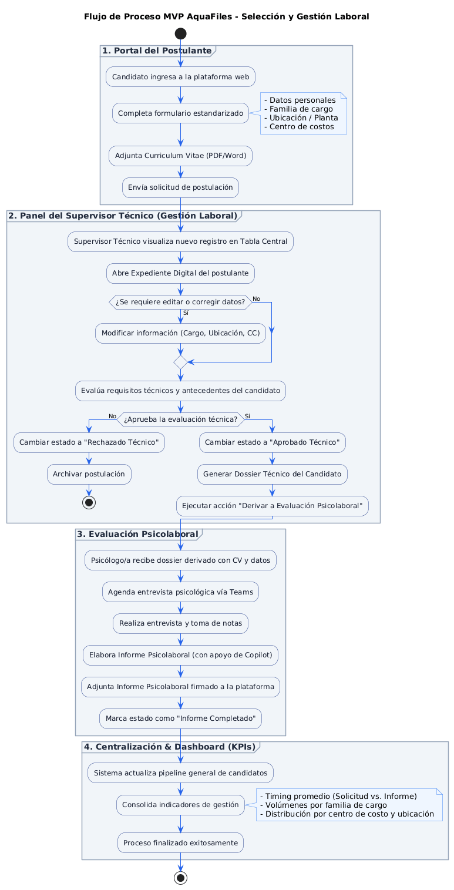
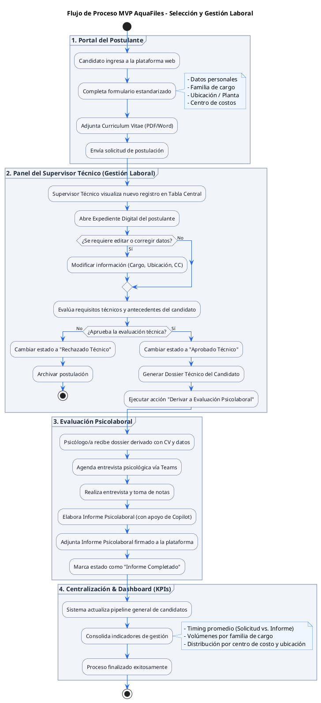

# DSY1104 · Full Stack II

## Actividad Bases del MVP

**Definición de roles, permisos, interfaces y flujo del MVP**
**Proyecto Full Stack II · Caso AquaChile**

| Campo | Detalle |
| :--- | :--- |
| **Integrantes** | Felipe Barra / Aolani Caiguan / Renata Orellana |
| **Fecha** | 23-09-2026 |
| **Repositorio** | [Linn-Unix/FullStack-II-002D-CasoAquaFiles](https://github.com/Linn-Unix/FullStack-II-002D-CasoAquaFiles) |
| **Versión PDF** | [Actividad_Bases_MVP_AquaChile_DSY1104.pdf](Actividad_Bases_MVP_AquaChile_DSY1104.pdf) |

---

## Propósito

Antes de comenzar a desarrollar con React, el equipo analiza la información disponible y deja definidas las bases del software que construirá.

El objetivo es explicar con claridad quién utilizará el sistema, qué podrá hacer, qué interfaces necesita el MVP, cómo se conectan entre sí y qué funcionalidad tendrá cada una.

> **Regla principal:** cada decisión se justifica con el caso, la entrevista y el material entregado. Lo que no está claro se registra como una duda pendiente para canalizarla con la empresa.

### Material revisado

- Caso académico del proyecto.
- PPT de presentación de la problemática.
- Entrevista en video y transcripción generada en la entrevista.
- Otros antecedentes agregados en la carpeta de contexto.

---

## 1. Roles y permisos

| Rol propuesto | Evidencia que lo justifica | ¿Qué puede ver? | ¿Qué puede hacer? | ¿Qué no debería hacer? |
| :--- | :--- | :--- | :--- | :--- |
| **Supervisor Técnico / Analista de reclutamiento** | El analista de reclutamiento y selección debe recibir esta solicitud, empezar a buscar candidatos y hacer entrevistas. Una parte de este proceso es la evaluación psicolaboral. | Tabla general de candidatos, carpetas digitales, ficha técnica de candidatos, CV adjunto, centro de costos y dashboard de indicadores. | Registrar y editar datos del candidato, filtrar y buscar candidatos, evaluar la etapa técnica, cambiar estados del pipeline y exportar/derivar el paquete de antecedentes (dossier) al psicólogo. | Redactar el informe psicolaboral definitivo o alterar los criterios de la pauta psicológica privada. |
| **Psicólogo/a Evaluador/a** | La persona encargada de las entrevistas psicolaborales debe tener constancia de los postulantes que le han sido derivados. | Listado de candidatos aprobados en la fase técnica, dossier técnico derivado, CV del candidato, pauta de entrevista y estado de informes. | Consultar el expediente técnico recibido, actualizar la fecha de la entrevista psicolaboral, subir el informe psicolaboral final y marcar la tarea como completada. | Modificar la calificación técnica otorgada por el supervisor o eliminar candidatos del pipeline técnico. |
| **Postulante / Candidato** | La psicóloga menciona que el candidato postula y debe entregar su CV. Se requiere que el postulante ingrese su información y su CV directamente. | Formulario de postulación y estado actual de su candidatura ("En revisión técnica", "Agendado", "Proceso finalizado"). | Registrar sus datos personales, seleccionar la ubicación y familia de cargo, adjuntar su CV (PDF/Word) y consultar el estado de su postulación. | Ver datos de otros candidatos, acceder al dashboard interno, ver notas técnicas o modificar estados del proceso. |

---

## 2. Diseño de interfaces necesarias

| Interfaz | Usuario/rol | Objetivo | Captura o nombre de archivo en GitHub | Acción principal |
| :--- | :--- | :--- | :--- | :--- |
| **1. Portal de Postulación y Carga de CV** | Postulante | Permitir al candidato registrarse, ingresar sus datos y subir su CV en un solo formulario estandarizado. | `src/assets/mockups/01_portal_postulante.png` | Completar el formulario y subir el archivo CV. |
| **2. Panel del Supervisor Técnico (Gestión Laboral)** | Supervisor Técnico | Visualizar en una tabla interactiva todos los candidatos, editar la información modificable, filtrar por planta/cargo y gestionar estados. | `src/assets/mockups/02_panel_supervisor.png` | Filtrar, buscar, editar registros y cambiar de estado en el pipeline. |
| **3. Expediente Digital y Dossier del Candidato (Modal / Vista Detalle)** | Supervisor Técnico / Psicólogo | Mostrar en un solo lugar los archivos del candidato (CV, descriptores), las notas técnicas y la opción de derivación. | `src/assets/mockups/03_expediente_candidato.png` | Visualizar/descargar el CV, agregar observaciones técnicas y derivar a la etapa psicológica. |
| **4. Dashboard de Indicadores y Tiempos (KPIs)** | Supervisor Técnico / Admin | Visualizar métricas operativas. | `src/assets/mockups/04_dashboard_kpis.png` | Consultar gráficos y filtrar indicadores por período o centro de costo. |

---

## 3. Funcionalidades de cada interfaz

| Interfaz | Funcionalidad | Dato o acción involucrada | Prioridad |
| :--- | :--- | :--- | :---: |
| **Portal de Postulación** | Registro de candidato y carga de documento | Cargar nombre, correo, ubicación, familia de cargo, centro de costos y archivo CV (PDF/Word). | Alta |
| **Panel del Supervisor** | Tabla interactiva de candidatos (reemplazo de Excel) | Buscar por nombre/RUT, filtrar por familia de cargo/ubicación, ordenar por fecha. | Alta |
| **Panel del Supervisor** | Edición dinámica de datos del candidato | Modificar campos en caso de error o ajuste de cargo/ubicación. | Alta |
| **Panel del Supervisor** | Control de estados del pipeline (reemplazo de Planner) | Cambiar estado: "Solicitud Recibida" → "Aprobado Técnico" → "Derivado a Psicólogo" → "Informe Completado". | Alta |
| **Expediente Digital** | Gestor centralizado de archivos y CVs | Visualizador de CV, descarga de pauta técnica y adjunto de descriptores de cargo. | Alta |
| **Expediente Digital** | Generación/envío de dossier técnico para Psicología | Acción de derivar el expediente preparado con antecedentes para la evaluación psicológica. | Media |
| **Dashboard de KPIs** | Visualización de indicadores de gestión | Cálculo del tiempo promedio (timing) desde la solicitud hasta el informe final, gráficos por centro de costo y familia de cargo. | Media |

---

## 4. Flujo principal del sistema

| Paso | Acción del usuario | Interfaz | ¿Existe una decisión? |
| :---: | :--- | :--- | :---: |
| **1** | El Postulante ingresa a la plataforma, completa sus datos personales, selecciona el cargo/ubicación y sube su CV en PDF. | Portal de Postulación y Carga de CV | No |
| **2** | El Supervisor Técnico ingresa al panel principal, revisa la tabla de candidatos y abre la ficha del postulante. | Panel del Supervisor Técnico | No |
| **3** | El Supervisor Técnico evalúa los antecedentes técnicos y valida la información. ¿Los datos requieren corrección? | Expediente Digital y Dossier | Sí |
| **4** | El Supervisor Técnico decide si el candidato cumple con el perfil técnico necesario. ¿Aprueba la etapa técnica? | Expediente Digital y Dossier | Sí |
| **5** | Al aprobar la etapa técnica, el Supervisor Técnico presiona "Derivar a Evaluación Psicolaboral", notificando al Psicólogo con el expediente adjunto. | Expediente Digital y Dossier | No |
| **6** | La Psicóloga accede al expediente del candidato derivado, revisa el CV y los antecedentes técnicos, agenda la entrevista en Teams y adjunta el informe psicolaboral final. | Expediente Digital (Vista Psicólogo) | No |
| **7** | El sistema actualiza automáticamente el estado a "Proceso Completado" y calcula las métricas en el Dashboard de Indicadores (timing, tasa de aprobación). | Dashboard de Indicadores y Tiempos | No |

---

## 5. Diagrama de flujo

Ver código PlantUML del diagrama

---

## Dudas pendientes para la contraparte

Información ambigua o incompleta encontrada durante el análisis, para resolver con la empresa:

1. ¿Qué ve el postulante si queda fuera del proceso?
2. ¿Teams y Copilot se conectan a la plataforma o se usan por fuera?
3. ¿El sistema debe enviar correos automáticos?
4. ¿Cómo se mide exactamente el tiempo del proceso?
5. ¿Hasta qué momento el supervisor puede corregir datos?
6. ¿El candidato puede cambiar su CV si se equivocó?
